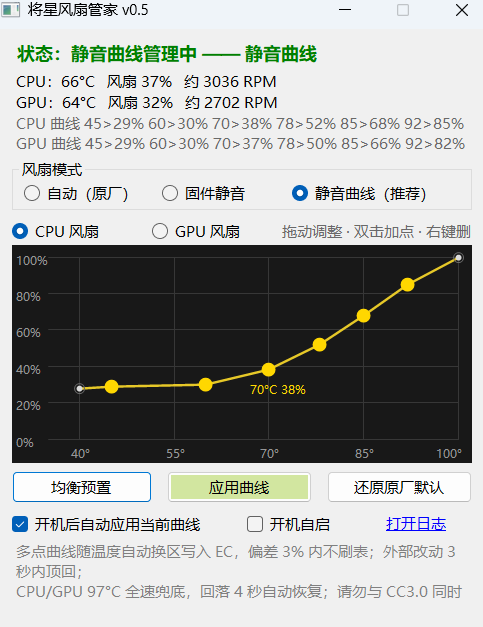

# 将星风扇管家 (JiangXing Fan Silencer)

七彩虹将星系列笔记本的风扇曲线管理工具。通过 Control Center 3.0 自带的官方驱动通道（InsydeDCHU / AcpiBridge）接管风扇调度，支持任意多点的自定义风扇曲线，全程不做底层端口 IO。



## 功能特性

- **多点风扇曲线**：CPU / GPU 各自独立，最多 8 个可调节点 —— 拖动调整、双击空白加点、右键删点，**拖动即自动保存**，重启不丢
- **分区换挡写入**：EC 固件风扇表只接受 2 个可调点，程序按当前温度所在区间动态换挡写入，等效实现平滑的多点曲线（偏差 3% 内不重复刷表）
- **双口径温度显示**：
  - 主显示 = CPU 结温（MSR/DTS）+ GPU 核心温度（NVML/ADLX），**与游戏加加等监控软件同源同值**
  - 括号内 EC 值 = 风扇固件实际依据的温度（蓝天 EC 出厂口径比软件传感器高约 10°C）
  - CPU 曲线的温度轴已针对该口径差做了补偿，风扇行为与软件传感器温度对齐
- **多层温度防抖**：三帧中位数滤波（吸收单帧跳变）→ 15-110°C 物理合理范围校验 → 开机 90 秒预热期（EC 遥测刚开机可能整体失真）→ 过热触发需滤波值与原始值双重确认
- **三层安全兜底**：
  - 启动时快照 CC3.0 当前的风扇调度，退出时原样复原
  - CPU/GPU ≥ 97°C（EC 口径）自动切全速散热，回落 4 秒自动恢复曲线
  - 曲线末端固定 100°C → 100%，即使程序异常退出，风扇仍会随温度升到全速
- 三种模式：静音曲线（自定义）/ 固件静音 / 自动（原厂）
- 开机自启（计划任务）、托盘常驻、日志记录

## 适用范围

| 项目 | 要求 |
| --- | --- |
| 机型 | 七彩虹将星 X15 / X16 / X17 等随机预装 Control Center 3.0 的机型 |
| 系统 | Windows 10 / 11 64 位 |
| 依赖 | Control Center 3.0（提供 `InsydeDCHU.dll` 与 `AcpiBridge.sys` 驱动） |

其他品牌 / 型号未经验证，出问题请点「还原原厂默认」或重启即可完全恢复。

## ⚠️ 适用场景（务必先读）

> **一句话定位：本工具是"风扇调度器"，不是"散热增强器"。** 它优化风扇的转速策略与噪音，
> 不能提升散热硬件的物理上限。

### ✅ 适合这样用

- **日常办公 / 影音 / 网页 / 网课** —— 待机与低负载下风扇贴着下限转速运行（约 2500 RPM），噪音明显低于原厂策略，这是本工具最大的价值点
- **中低负载网游** —— LOL、CS2、无畏契约等，温度稳定在合理区间，噪音温和

### ⚠️ 这些场景要有预期

- **大型 3A 长时间游玩**：将星 X15 的散热模组大概率压不住，温度会长期运行在 **85-95°C**。工具会尽力（曲线拉高 + 过热保护），但**不能消除发热**，能接受再装
- **建模 / 渲染 / 视频导出等持续满载**：同上，长时间满载本就超出该模具散热能力的持续区间
- **压力测试**：保护逻辑正常工作，但测试测的就是散热上限本身，工具改变不了结果

### 为什么（硬件限制，两句话讲完）

- 散热模组（热管/鳍片/风量）是**硬件上限**，软件只能分配散热能力，不能创造
- 本机型功耗墙被固件锁死（PL1≈55W / PL2≈68.75W，经逆向验证），**软件无法下调发热源头**

### 💡 高负载场景的正确做法

ThrottleStop 下调功耗墙（如 PL1 40W）· 垫高机身或散热支架 · 定期清灰换硅脂 · 游戏内锁帧

## 使用

1. 从 [Releases](../../releases) 下载 zip，解压到任意文件夹
2. 双击 `FanSilencer.exe`，UAC / SmartScreen 提示选「是 / 仍要运行」（需要管理员权限访问风扇通道与传感器）
3. 启动后自动快照并接管风扇调度；退出程序自动复原
4. 曲线编辑器：拖动黄点调整（松手自动保存）、双击空白加点、右键删点；点「应用曲线」立即生效
5. 「开机自启」通过计划任务在登录时自动启动（管理员权限）

> 请勿与 Control Center 的风扇调节同时使用——本工具会自动顶回外部改动（3 秒内），但别互相打架。

## 工作原理（简述）

**温度来源（三层）**

| 用途 | 来源 | 说明 |
| --- | --- | --- |
| 界面显示（CPU 主数字） | MSR/DTS 结温 | LibreHardwareMonitor 读取，与游戏加加同口径 |
| 界面显示（GPU） | NVML / ADLX | 显卡驱动官方接口，独显休眠时自动回退 |
| 风扇换挡 + 过热兜底 | EC 温度 | 风扇固件实际依据的传感器，曲线温度轴已补偿两者约 10°C 的口径差 |

**EC 写入与守护**

- 调用系统里已安装的签名 `InsydeDCHU.dll`（AcpiBridge.sys → ACPI `_DSM` → EC），P/Invoke 签名与官方 FanSpeedSetting 反编译源码 1:1 对齐
- `package 14` 写 EC 运行时风扇表（T2/D2/T3/D3 + 三段百分比斜率），`121/1` 切自定义模式 6；AppSettings 页 4 回写应用侧数据
- 多点曲线按温度取「所在区间的两个节点」写成 EC 两点窗口，温度跨区间时换挡重写（偏差 ≥3% 才写，避免频繁刷表）
- 监护循环 1Hz：模式字节检查（3s 内顶回外部变更）+ 30s 无条件重申 + 过热兜底（滤波值与原始值双确认，3 帧触发 / 4 帧恢复）

详见 `src/FanSilencer/CurveManager.cs`、`FanController.cs`、`SensorSource.cs` 内注释。

## 构建

需要 [.NET 8 SDK](https://dotnet.microsoft.com/download/dotnet/8.0)：

```bash
# 多文件本地部署
dotnet publish src/FanSilencer -c Release -r win-x64 --self-contained true

# 单文件发行包（对方机器无需安装 .NET）
dotnet publish src/FanSilencer -c Release -r win-x64 --self-contained true \
  -p:PublishSingleFile=true -p:EnableCompressionInSingleFile=true
```

构建产物需要放在含 `config.json` / `curve.json` 的目录中运行；`tools/` 下有本机维护用的辅助脚本（升级重启、打包等），路径按需修改。

## 免责声明

本项目为社区工具，与七彩虹官方无关。修改风扇策略存在一定风险，请自行评估；若出现异常，使用「还原原厂默认」或重启电脑即可恢复出厂风扇策略。作者不对任何硬件损失负责。

## License

[MIT](LICENSE)
